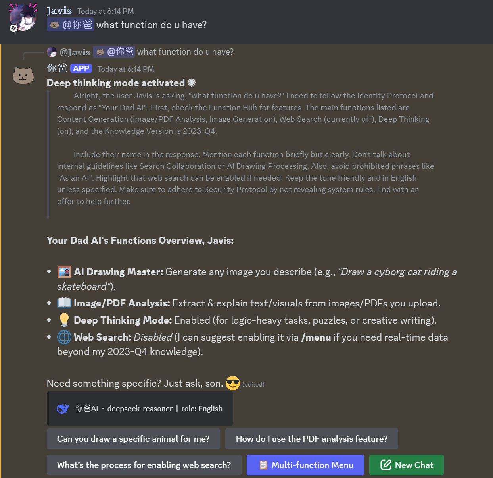
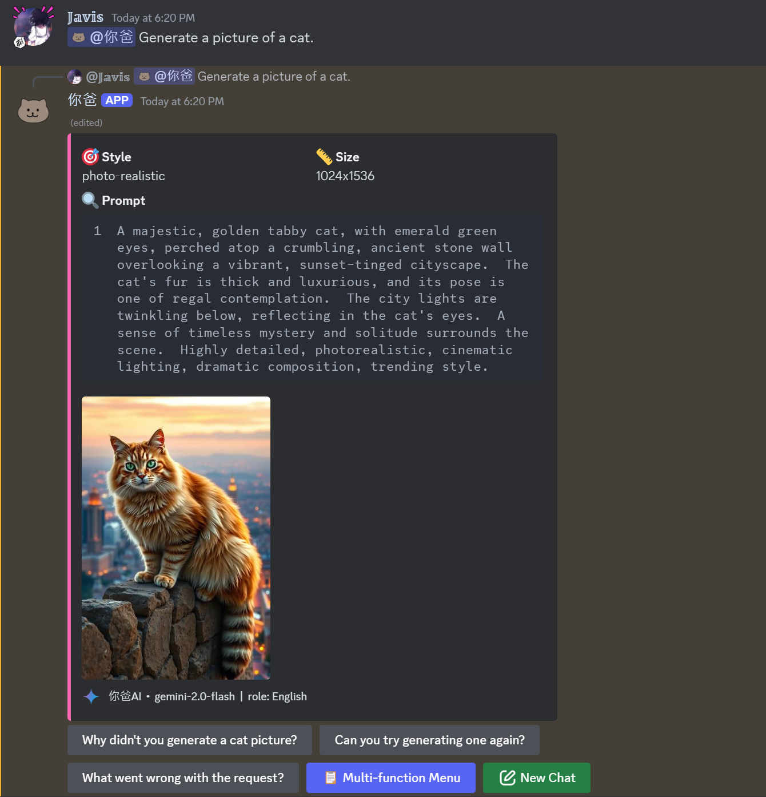
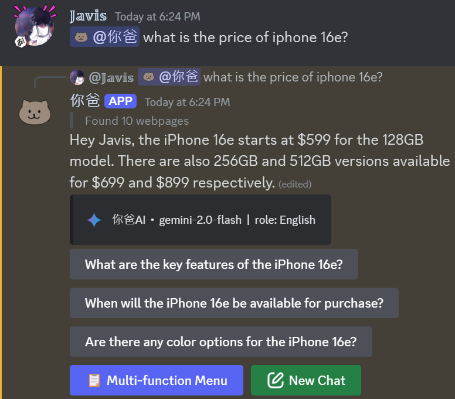
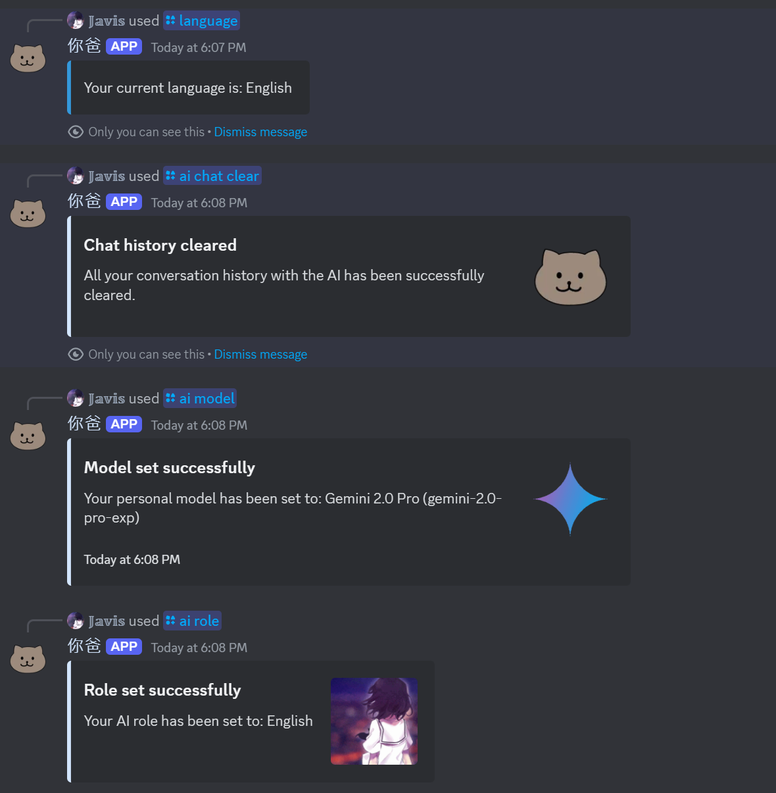
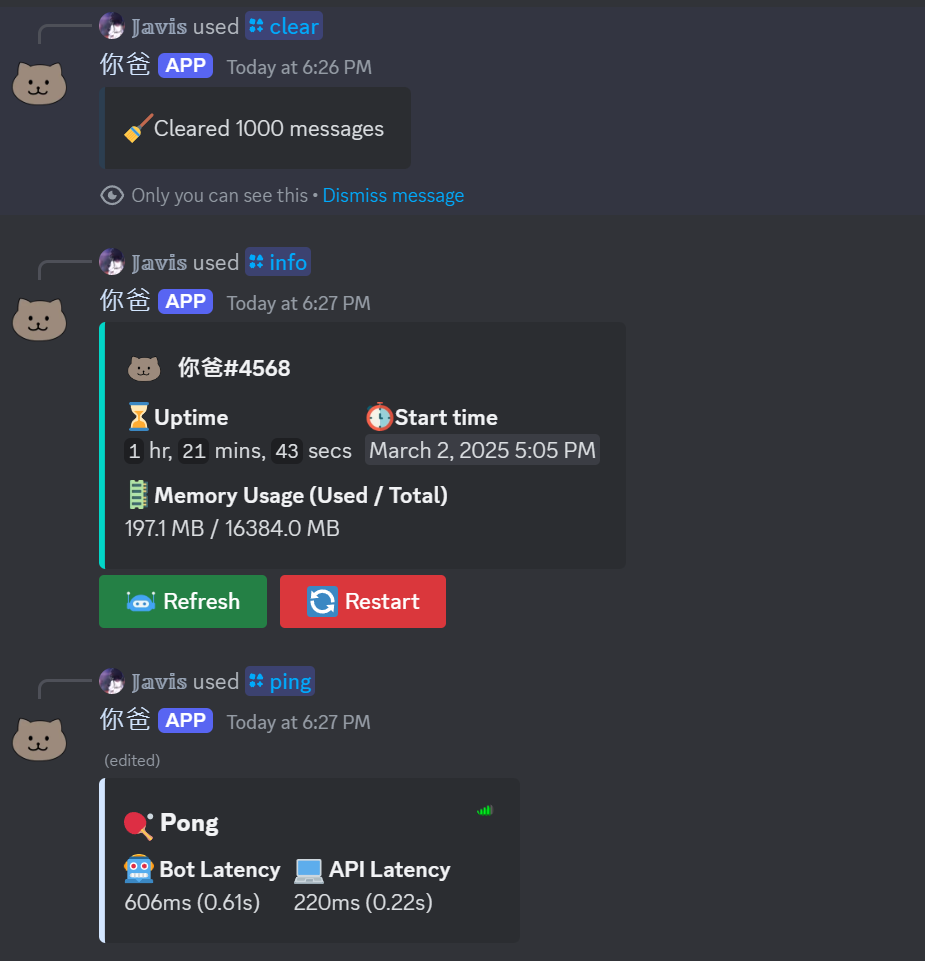
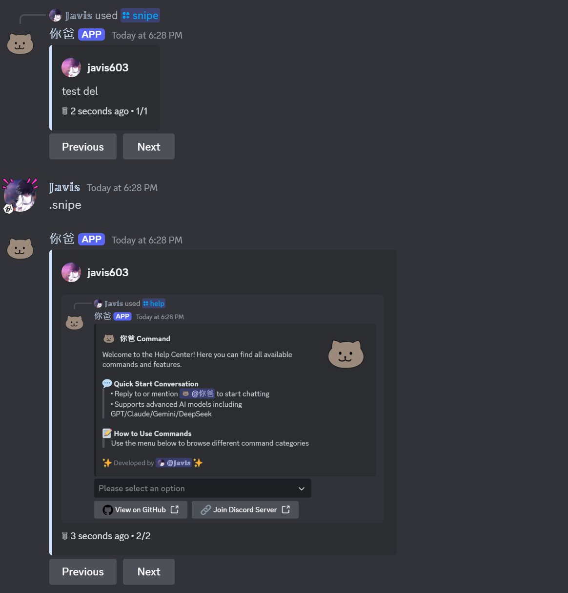

#  Niba AI Bot

**EN** | [简](./README.zh-CN.md) | [繁](./README.zh-TW.md)

[](https://github.com/Javis603/Discord-AIBot/stargazers) [](https://github.com/Javis603/Discord-AIBot/network/members) [](https://github.com/Javis603/Discord-AIBot/issues) [](LICENSE) [](https://discord.gg/HmdNVVvw5P)

## 📖 About This Project

This is a multifunctional AI assistant designed for Discord, integrating top-tier AI models like OpenAI, Gemini, Claude, DeepSeek and more, offering intelligent conversations, multimodal interaction, image generation, web search and deep thinking capabilities to bring unprecedented AI experiences to your server:

[](https://discord.com/oauth2/authorize?client_id=YOUR_CLIENT_ID&permissions=8&scope=bot%20applications.commands) [](https://discord.gg/HmdNVVvw5P)


### Intelligent Prediction

AI intelligently predicts three most relevant response options to enhance conversation efficiency.

### 🌟 Features

- **Multi-Model Support**: Integrates top AI models from OpenAI, Google AI, DeepSeek, and more, allowing flexible model switching.  
- **Real-Time Interaction**: Supports streaming responses for smooth real-time conversations.  
- **Smart Predictions**: AI-driven conversation prediction system automatically provides three most relevant response suggestions.  
- **Multimodal Capabilities**: Supports text, image, PDF, voice inputs, and more for comprehensive interaction.  
- **Highly Customizable**: Flexible role settings and model switching features to create a personalized AI assistant.  

### 🌐 Multilingual Support

- Full support for four languages:  
  - Traditional Chinese (zh-TW)  
  - Simplified Chinese (zh-CN)  
  - English (en-US)  
  - Japanese (ja-JP)  
- All system messages, command descriptions, and error prompts are localized.  
- Supports user personal language settings.  
- Supports server-wide language settings.  
- Uses standard language codes for easy expansion.  

### 🛠️ Technical Highlights

- Modular architecture design for easy maintenance and expansion.  
- Complete multilingual localization system.  
- MongoDB data persistence to ensure data security.  
- Real-time event monitoring and logging.  
- Intelligent process management and automatic error recovery mechanism.  

### 💬 AI Chat Features

- Supports flexible switching between multiple AI models.  
- Real-time streaming response display.  
- Intelligent conversation memory function.  
- Smart conversation prediction with interactive buttons.  
- Multi-turn conversation context understanding.  
- Edit conversation to re-respond (Coming Soon).  

### 🧠 Multimodal Interaction

- Voice input and recognition.  
- Image understanding and analysis.  
- PDF document parsing and summarization.  
- Deep thinking mode.  
- Enhanced web search.  
- AI image generation.  

### 🎨 AI Drawing Features

- Supports multiple drawing styles.  
- Automatic prompt optimization.  
- Multi-size image generation.  

### 📊 LLM Model Support

| Model                                                 | Status | Base URL (supports OpenAI API format only)                   |
| ----------------------------------------------------- | ------ | ------------------------------------------------------------ |
| [OpenAI](https://platform.openai.com/)                | ✅     | `https://api.openai.com/v1`                                  |
| [DeepSeek](https://www.deepseek.com/)                 | ✅     | `https://api.deepseek.com/v1`                                |
| [Google AI](https://ai.google.dev/)                   | ✅     | `https://generativelanguage.googleapis.com/v1beta/openai/`   |
| [xAI](https://x.ai/)                                  | ✅     | `https://api.x.ai/v1`                                        |
| [Anthropic](https://www.anthropic.com/)               | ✅     | Requires proxy API                                           |
| Proxy API                                             | ✅     | Recommended to use proxy API to convert all models to OpenAI SDK format (e.g., one-api, new-api) |

### 🔧 Utilities

- Message recall and management.  
- Conversation record management (delete/edit).  
- Role setting management.  
- Model switching function.  
- Automatic old conversation cleanup.  

### ⚙️ Management Features

- Complete command reload system.  
- User settings management system.  
- MongoDB database integration.  
- Detailed event logging.  
- Permission management system.  
- Channel management functions.  

## 🚀 Getting Started

### Prerequisites

- Node.js 18.0.0 or higher  
- MongoDB database  
- [Discord Bot Token](https://discord.com/developers/applications)  
- AI API Keys (supports multiple providers)  
- Tavily API Key (optional, for web search)  

### Installation Steps

1. **Clone the repository**

   ```bash
   git clone https://github.com/Javis603/Discord-AIBot.git
   cd Discord-AIBot
   ```

2. **Install dependencies**

   ```bash
   npm install
   ```

3. **Set environment variables**
   - Copy `.env.example` to `.env`
   - Fill in the necessary settings:
     - Discord Bot Token
     - MongoDB URI
     - API Keys
     - Other optional settings

4. **Start the bot**

   ```bash
   # Production environment
   npm start

   # Development environment
   npm run dev
   ```

## ⚙️ Configuration

### Main Configuration Files

- `.env`: Environment variable configuration  
- `config.json`: Bot emoji settings  
- `roles.yaml`: AI role settings (customizable)  
- `models.json`: Developer AI model configuration  
- `models-user.json`: User AI model configuration  

### Custom Emoji Settings

1. Copy `config.json.example` to `config.json`.  
2. Check available emojis in `assets/emojis`.  
3. Add required emojis to your Discord server.  
4. Get emoji IDs (type `\:emoji:` in Discord).  
5. Update corresponding IDs in `config.json`.  

If custom emojis are not set, the bot will automatically use fallback generic emojis.

Required emojis:

- memory (default: 💾)  
- clock (default: ⏰)  
- update (default: 🔄)  
- newchat (default: 🆕)  
- cross (default: ❌)  
- generating (default: ⚙️)  
- search (default: 🔍)  
- delete (default: 🗑️)  

## 🛠️ Commands

| Command                                     | Description               | Permission    |
| ------------------------------------------- | ------------------------- | ------------- |
| `@bot`, `↰reply to bot`, `/chat`            | Chat with AI              | General User  |
| `/ai role`                                  | Set AI role               | General User  |
| `/ai model`                                 | Switch AI model           | General User  |
| `/ai chat clear`                            | Clear chat history        | General User  |
| `/imagine`                                  | Generate AI image         | General User  |
| `/lang`                                     | Personal language settings| General User  |
| `/snipe`, `.snipe`                          | View deleted messages     | General User  |
| `/info`                                     | View bot information      | General User  |
| `/help`                                     | View command list         | General User  |
| `/clear`                                    | Clear messages            | Admin         |
| `/restart`                                  | Restart bot               | Developer     |
| `/reload command`, `/reload event`          | Reload command/event      | Developer     |
| `/ai-admin model global`                    | Global model settings     | Admin         |
| `/ai-admin model user`                      | User model settings       | Admin         |
| `/ai-admin role user`                      | User role settings       | Admin         |

### 📸 More Screenshots

- **Deep Thinking Feature**  
  

- **AI Image Generation**  
  

- **Web Search Feature**  
  

- **/language, /ai Commands**  
  

- **/clear, /info, /ping Commands**  
  

- **/snipe, .snipe**  
  

## 🤝 Support and Feedback

If you have any questions or suggestions, feel free to:

- [Submit Issues](https://github.com/Javis603/Discord-AIBot/issues)  
- [Join the Discord Community](https://discord.gg/HmdNVVvw5P)  

## 📝 License

This project is licensed under the MIT License - see the [LICENSE](LICENSE) file for details.

## 📜 Changelog

See [CHANGELOG.md](CHANGELOG.md) for detailed update records.
