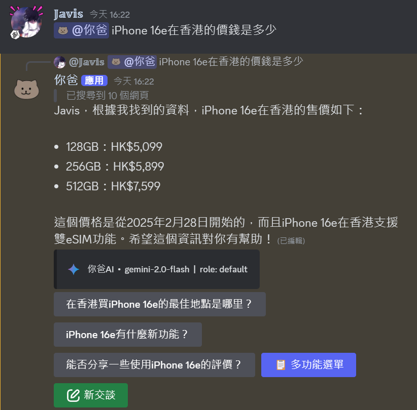
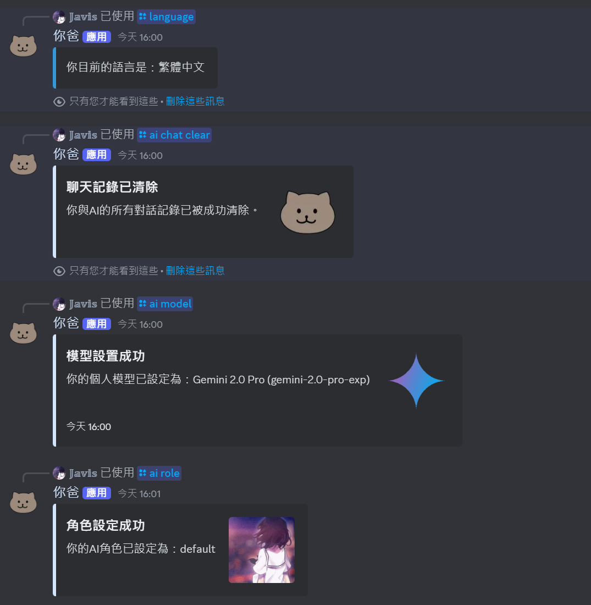
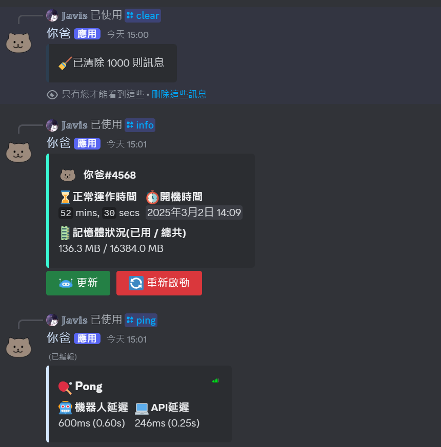
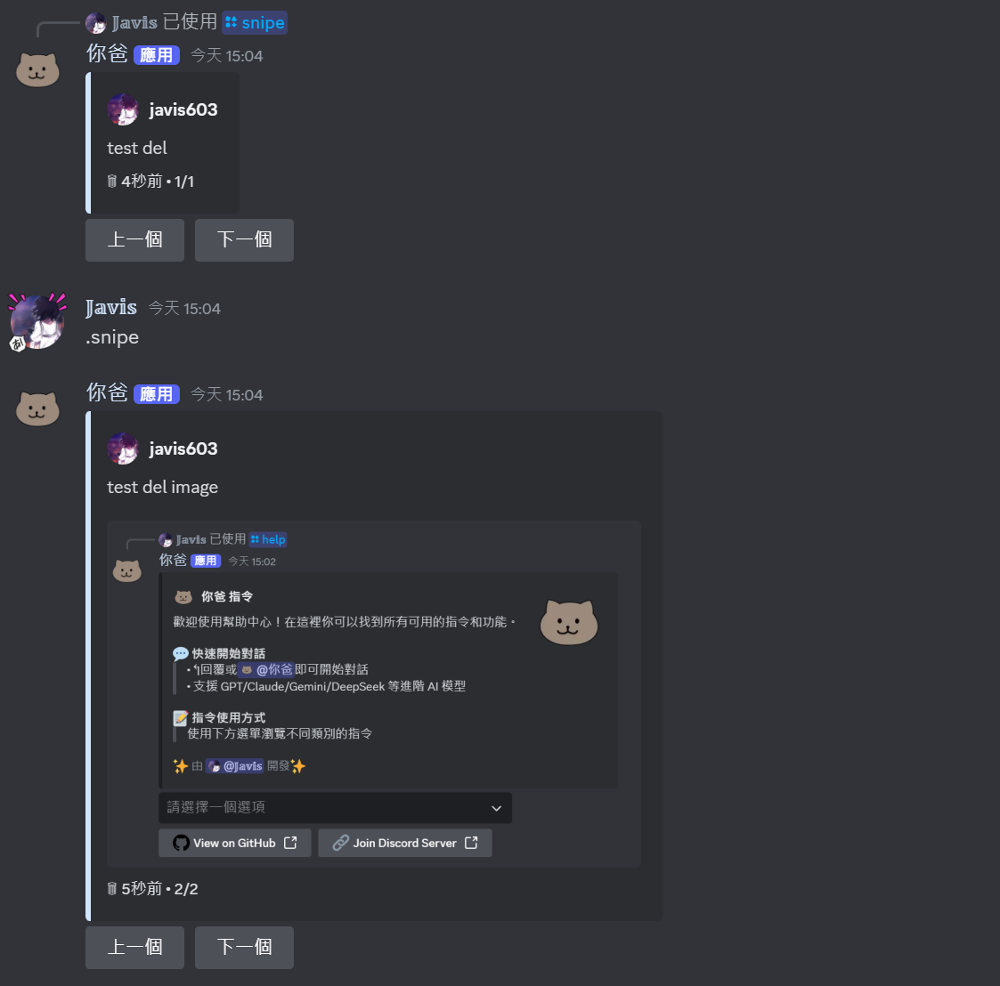

<p align="right">
   <a href="./README.zh-TW.md">繁</a> | <strong>简</strong> | <a href="./README.md">EN</a>
</p>
<div align="center">
  <h1>
    
    你爸 AI Bot
  </h1>

  <p align="center">
    
    
    
    
    <a href="https://discord.gg/HmdNVVvw5P"></a>
  </p>
</div>

## 📖 关于本项目

这是一个专为 Discord 设计的多功能 AI 助手，整合 OpenAI、Gemini、Claude、DeepSeek 等顶尖 AI 模型，支持智能对话、多模态交互、图片生成、联网搜索和深度思考功能，为您的服务器带来前所未有的智能体验：

<div align="center">
  <p align="center">
    <a href="https://discord.com/oauth2/authorize?client_id=1341946222994526359">
      
    </a>
    <a href="https://discord.gg/HmdNVVvw5P">
      
    </a>
  </p>
</div>

<div>
  
  <p align="center"><sub>↑ AI 智能预测三个最相关的回应选项，提升对话效率</sub></p>
</div>

### 🌟 主要特点
- **多模型支持**：整合 OpenAI、Google AI、DeepSeek 等顶级 AI 模型，灵活切换不同模型
- **即时交互**：支持流式响应，实现流畅的即时对话体验
- **智能预测**：AI 驱动的对话预测系统，自动提供三个最相关的回应建议
- **多模态能力**：支持文字、图片、PDF、语音等多种输入方式，全方位交互
- **高度定制化**：弹性的角色设置和模型切换功能，打造专属 AI 助手

### 🌐 多语言支持
- 完整支持四种语言：
  - 繁体中文 (zh-TW)
  - 简体中文 (zh-CN)
  - 英文 (en-US)
  - 日文 (ja-JP)
- 所有系统消息、指令说明和错误提示均已本地化
- 支持用户个人语言设置
- 支持服务器全局语言设置
- 使用标准语言代码，便于扩展

### 🛠️ 技术特色
- 模块化架构设计，易于维护和扩展
- 完整的多语言本地化系统
- MongoDB 数据持久化，确保数据安全
- 实时事件监控和日志记录
- 智能进程管理与自动错误恢复机制

### 💬 AI 聊天功能
- 支持多种 AI 模型灵活切换
- 实时流式响应显示
- 智能对话记忆功能
- 智能对话预测与交互按钮
- 多轮对话上下文理解
- 编辑对话以重新响应 (Coming Soon)

### 🧠 多模态交互
- 语音输入与识别
- 图像理解与分析
- PDF 文件解析与摘要
- 深度思考模式
- 网络搜索增强
- AI 图像生成

### 🎨 AI 绘图功能
- 支持多种绘图风格
- 自动优化提示词
- 多尺寸图像生成

### 📊 LLM 模型支持

| 模型 | 状态 | Base URL (仅支持 OpenAI 接口格式) |
| --- | --- | --- |
| [OpenAI](https://platform.openai.com/) | ✅ | https://api.openai.com/v1 |
| [DeepSeek](https://www.deepseek.com/) | ✅ | https://api.deepseek.com/v1 |
| [Google AI](https://ai.google.dev/) | ✅ | https://generativelanguage.googleapis.com/v1beta/openai/ |
| [xAI](https://x.ai/) | ✅ | https://api.x.ai/v1 |
| [Anthropic](https://www.anthropic.com/) | ✅ | 需使用中转API |
| 中转API | ✅ | 推荐使用中转API把所有模型转成至OpenAI SDK格式 (如 one-api, new-api) |

### 🔧 实用工具
- 消息回收与管理
- 对话记录管理（删除/编辑）
- 角色设置管理
- 模型切换功能
- 自动旧对话清理

### ⚙️ 管理功能
- 完整的指令重载系统
- 用户设置管理系统
- MongoDB 数据库集成
- 详细的事件日志记录
- 权限管理系统
- 频道管理功能

## 🚀 开始使用

### 前置需求
- Node.js 16.9.0 或更高版本
- MongoDB 数据库
- [Discord Bot Token](https://discord.com/developers/applications)
- AI API Keys（支持多种服务商）
- Tavily API Key（可选，用于网络搜索）

### 安装步骤

1. **克隆项目**
```bash
git clone https://github.com/Javis603/Discord-AIBot.git
cd Discord-AIBot
```

2. **安装依赖**
```bash
npm install
```

3. **设置环境变量**
   - 复制 `.env.example` 为 `.env`
   - 填入必要的设置值：
     - Discord Bot Token
     - MongoDB URI
     - API Keys
     - 其他可选设置

4. **启动机器人**
```bash
# 正式环境
npm start

# 开发环境
npm run dev
```

## ⚙️ 配置说明

### 主要配置文件
- `.env`：环境变量配置
- `config.json`：机器人表情符号设置
- `roles.yaml`：AI 角色设置（可自定义）
- `models.json`：开发人员用的AI模型配置
- `models-user.json`：用户使用的AI模型配置

### 自定义表情符号设置

1. 复制 `config.json.example` 为 `config.json`
2. 在 `.github/assets/emojis` 中查看可用的表情符号
3. 在 Discord 服务器中添加需要的表情符号
4. 获取表情符号 ID（在 Discord 中输入 \\:表情符号:）
5. 在 `config.json` 中更新对应的 ID

如果没有设置自定义表情符号，机器人会自动使用 fallback 的通用表情符号。

需要的表情符号：
- memory (默认: 💾)
- clock (默认: ⏰)
- update (默认: 🔄)
- newchat (默认: 🆕)
- cross (默认: ❌)
- generating (默认: ⚙️)
- search (默认: 🔍)
- delete (默认: 🗑️)

## 🛠️ 指令列表

| 指令 | 说明 | 权限 |
|------|------|------|
| `@bot`<br>`↰回复bot`<br>`/chat` | 与 AI 对话 | 一般用户 |
| `/ai role` | 设置 AI 角色 | 一般用户 |
| `/ai model` | 切换 AI 模型 | 一般用户 |
| `/ai chat clear` | 清除对话记录 | 一般用户 |
| `/imagine` | 生成 AI 图片 | 一般用户 |
| `/lang` | 个人语言设置 | 一般用户 |
| `/snipe`<br>`.snipe` | 查看删除消息 | 一般用户 |
| `/info` | 查看机器人信息 | 一般用户 |
| `/help` | 查看指令列表 | 一般用户 |
| `/clear` | 清除消息 | 管理员 |
| `/restart` | 重启机器人 | 开发者 |
| `/reload command`<br>`/reload event` | 重载指令/事件 | 开发者 |
| `/ai-admin model global` | 全局模型设置 | 管理员 |
| `/ai-admin model user` | 用户模型设置 | 管理员 |
| `/ai-admin role user` | 用户角色设置 | 管理员 |

### 📸 更多截图

<table>
  <tr>
    <td align="center" width="50%">
      
      <p><sub>深度思考功能展示</sub></p>
    </td>
    <td align="center" width="50%">
      
      <p><sub>AI图像生成功能</sub></p>
    </td>
  </tr>
  <tr>
    <td align="center" width="50%">
      
      <p><sub>联网搜索功能</sub></p>
    </td>
    <td align="center" width="50%">
      
      <p><sub>/language、/ai 指令</sub></p>
    </td>
  </tr>
  <tr>
    <td align="center" width="50%">
      
      <p><sub>/clear、/info、/ping 指令</sub></p>
    </td>
    <td align="center" width="50%">
      
      <p><sub>/snipe、.snipe</sub></p>
    </td>
  </tr>
</table>


## 🤝 支持与反馈

如果您有任何问题或建议，欢迎：
- [提交 Issues](https://github.com/Javis603/Discord-AIBot/issues)
- [加入 Discord 社区](https://discord.gg/HmdNVVvw5P)

## 📝 授权条款

此项目使用 MIT 授权条款 - 查看 [LICENSE](LICENSE) 文件了解更多

## 📜 更新日志

请查看 [CHANGELOG.md](CHANGELOG.md) 了解详细更新记录
